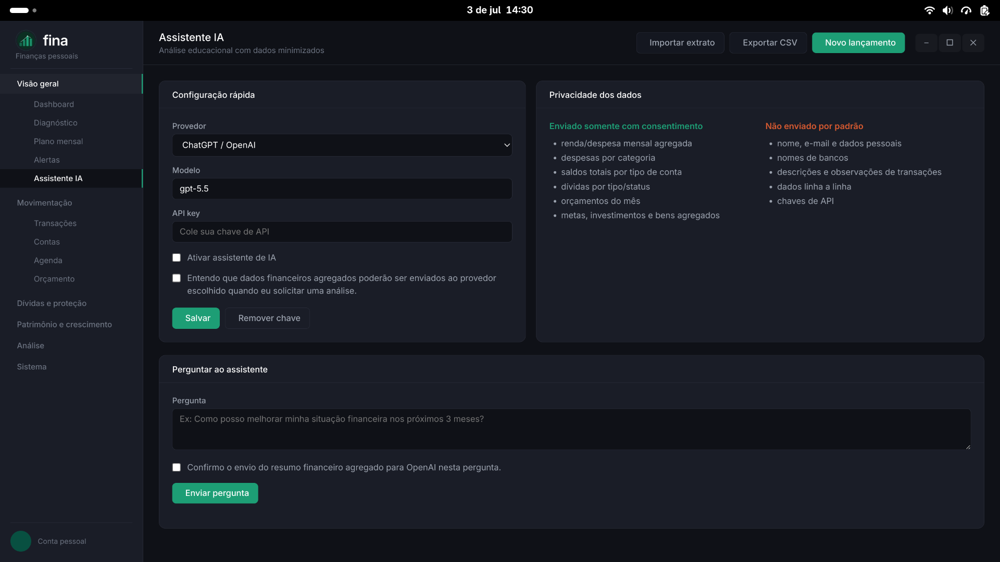

# Fina — Gerenciador de Finanças Pessoais

Aplicativo desktop para controle de finanças pessoais, construído com **Electron + TypeScript + SQLite**.

O Fina foi criado para ajudar pessoas a enxergarem sua situação financeira, planejarem como sair das dívidas e encontrarem caminhos para aumentar seu patrimônio.


## Destaques da versão 15.0

- Botão `Criar com IA` em Lançamentos, Contas a pagar, Orçamento, Dívidas e Metas.
- A IA interpreta pedidos em linguagem natural e abre o formulário existente já pré-preenchido como rascunho.
- Em Lançamentos, `Criar lote com IA` transforma uma lista informal em vários rascunhos editáveis, com salvamento dos itens selecionados.
- Todos os campos continuam editáveis e nada é salvo automaticamente; o usuário precisa revisar e clicar em `Salvar`.
- O fluxo reaproveita a mesma configuração, chave e consentimento da tela Assistente IA.

## Destaques da versão 14.0

- Nova tela `Open Finance` para centralizar provedores, instituições, contas e cartões conectados em uma visão única.
- Status operacional por provedor, com último sync, último erro, saldo vinculado e quantidade de contas/cartões.
- Sincronização Pluggy por provedor ou por conta específica diretamente pela central.
- Ação `Desconectar` remove credenciais e identificador da conexão, mas mantém contas e lançamentos já importados como dados locais.

## Destaques da versão 13.1

- Botão "Pagar fatura" em cartões de crédito: abre o lançamento já como transferência para o cartão, pedindo só meio de origem, valor e categoria — evita contar a mesma despesa duas vezes nos relatórios.

## Destaques da versão 13.0

- Sincronização Open Finance (Pluggy) com filtro de conta e período: depois da primeira sincronização, é possível importar apenas uma conta ou um intervalo de datas específico, em vez de sincronizar tudo de novo.
- Saldo consolidado e fluxo de caixa semanal no Dashboard para contas conectadas via Open Finance, com filtro por banco e destaque para os principais fatores (incluindo cobranças recorrentes).
- Alerta configurável de queda brusca de saldo em contas conectadas via Open Finance, com histórico de saldo por sincronização e aviso na tela Alertas.

## Destaques da versão 12.0

- Perguntas rápidas sugeridas no Assistente IA, contextuais ao score, reserva e categoria de maior gasto do mês.
- Botões "Resumo do dia", "Resumo da semana" e "Resumo do mês" no Assistente IA, com parágrafo em linguagem natural sobre a movimentação financeira do período, sob demanda.
- Histórico local de perguntas e respostas do Assistente IA, para consulta e comparação mês a mês, sem envio de dado novo a terceiros.
- Botão "Detalhar com IA" em cada decisão sugerida, com passo a passo prático gerado sob consentimento explícito por ação.
- Botão "Gerar rascunho com IA" na tela Renegociação, com rascunho de mensagem de negociação sem enviar nome do credor nem descrição da dívida.
- Previsão de saldo até o fim do mês no Dashboard, com os principais fatores (lançamentos e contas futuras) que influenciam a projeção.
- Detecção automática de recorrências e assinaturas esquecidas na tela Fixas, a partir do histórico de transações, com opção de cadastrar como fixa ou descartar a sugestão.
- Detecção de gastos fora do padrão na tela Alertas: valor incomum por categoria, possíveis duplicidades e recorrências com valor alterado, com opção de marcar como revisado.
- Leitura do valor total do comprovante mais robusta no OCR, em fotos com a coluna de valores desfocada.
- Sugestão automática de categoria por histórico de categorização, com justificativa visível, no lançamento manual, na leitura de comprovante e na importação de extratos — sem depender de IA.

## Destaques da versão 11.3

- Open Finance: credenciais para Pluggy, Belvo e Klavi, com sincronização inicial via Pluggy para contas, saldos e lançamentos.
- Lista de modelos de IA por provedor em `Configurações > IA`, com busca pela API quando houver chave salva e fallback local.
- Tela de `Lançamentos` renomeada no menu, com ícone próprio e campo de parcelamento para despesas em cartão de crédito.
- Preenchimento automático do valor total no primeiro meio de pagamento ao criar lançamento.
- Filtro de mês aprimorado na tela de orçamento, com mês anterior, próximo mês e mês atual.
- Cards de vale refeição e vale alimentação mostrando o valor disponível para gastar.
- Criptografia do banco de dados local com senha mestre.
- Sincronização entre dispositivos via arquivo .fin numa pasta de nuvem própria (Dropbox, Google Drive etc.).
- Serviço em segundo plano (Linux/Windows) para gerar recorrências e enviar alertas sem o app aberto.
- Contas em moeda estrangeira (USD/EUR) com conversão automática de saldo.
- Lançamento automático via OCR de comprovante/nota fiscal, processado 100% localmente.
- Canal de alertas por webhook, além de e-mail e notificação nativa.
- Detecção de aumento de preço em assinaturas e recorrências com intervalos flexíveis (semanal, trimestral, anual etc.).
- Modo envelope no orçamento, com saldo não gasto transportado para o mês seguinte.
- Simulador de aposentadoria/previdência.
- Menu lateral reorganizado em grupos e submenus.
- Manual do usuário dentro do aplicativo.
- Diagnóstico financeiro com classificação da situação atual.
- Plano mensal sugerido com direcionamento da margem disponível.
- Plano de saída das dívidas com comparação de estratégias.
- Reserva de emergência com cálculo de objetivo e contribuição mensal.
- Score de saúde financeira e revisão semanal para acompanhar evolução.
- Decisões sugeridas, renegociação de dívidas e objetivos automáticos.
- Simulador de patrimônio futuro.
- Jornada financeira guiada.
- Modo família/casal para separar lançamentos por responsável.
- Assistente IA com suporte a ChatGPT/OpenAI e Gemini/Google, desativado por padrão e com envio apenas de dados agregados mediante consentimento.

---

## Instalação

### Linux — Arch / Manjaro (AUR)

```bash
# Com yay
yay -S fina

# Com paru
paru -S fina
```

### Linux — Debian / Ubuntu (.deb)

```bash
# Baixe o .deb da página de releases
wget https://github.com/britors/Fina/releases/latest/download/fina_amd64.deb
sudo dpkg -i fina_amd64.deb
```

### Linux — Fedora / openSUSE (.rpm)

```bash
# Baixe o .rpm da página de releases
wget https://github.com/britors/Fina/releases/latest/download/fina_x86_64.rpm
sudo rpm -i fina_x86_64.rpm
# ou
sudo dnf install fina_x86_64.rpm
```

### Windows

Baixe o instalador `.exe` na [página de releases](https://github.com/britors/Fina/releases/latest) e execute-o.  
Compatível com Windows 10/11 (x64).

---

## Releases

Os pacotes são gerados automaticamente pelo GitHub Actions a cada tag `v*`.  
Acesse: **[github.com/britors/Fina/releases](https://github.com/britors/Fina/releases)**

| Plataforma | Arquivo | Gerado via |
| --- | --- | --- |
| Arch Linux | AUR (`fina`) | PKGBUILD — build from source |
| Debian / Ubuntu | `.deb` | GitHub Actions → electron-builder |
| Fedora / openSUSE | `.rpm` | GitHub Actions → electron-builder |
| Windows 10/11 | `.exe` (NSIS) | GitHub Actions → electron-builder |

### Criar um release

```bash
git tag v1.0.0
git push origin v1.0.0
```

O workflow `.github/workflows/release.yml` dispara automaticamente, gera os pacotes e cria o release com os artefatos.

---

## Desenvolvimento

### Pré-requisitos

- **Node.js** ≥ 18 (testado com v24)
- **npm** ≥ 9
- Ferramentas de compilação nativa para `better-sqlite3`:
  - **Linux:** `gcc`, `make`, `python3` (`build-essential`)
  - **Windows:** Visual C++ Build Tools

### Configuração

```bash
git clone https://github.com/britors/Fina.git
cd Fina
npm install
npm run build
npm start
```

### Scripts disponíveis

| Comando | Descrição |
|---|---|
| `npm run build` | Compila main + preload + renderer |
| `npm run watch` | Compilação contínua (dev) |
| `npm start` | Abre o app Electron |
| `npm run typecheck` | Verificação de tipos |
| `npm test` | Testes unitários |
| `npm run dist` | Empacota para a plataforma atual |
| `npm run dist:linux` | Gera `.deb` e `.rpm` |
| `npm run dist:win` | Gera instalador `.exe` |

---

## Funcionalidades

| Módulo | Descrição |
|---|---|
| Dashboard | Resumo financeiro, previsão de saldo 30 dias e até o fim do mês (com principais fatores), saldo e fluxo de caixa consolidados de contas Open Finance, indicadores de mercado |
| Diagnóstico | Leitura da situação financeira, classificação e próximos passos |
| Score | Pontuação de saúde financeira baseada em sobra mensal, reserva, dívidas, orçamento e gastos variáveis |
| Revisão semanal | Checklist financeiro da semana com resumo dos últimos 7 dias |
| Decisões | Prioridades sugeridas para recuperar margem, renegociar dívidas, formar reserva ou investir |
| Plano mensal | Sugestão de uso da renda para dívidas, reserva, metas e investimentos |
| Alertas | Riscos e oportunidades calculados a partir dos dados financeiros, incluindo detecção de gastos fora do padrão (valor incomum, duplicidade, recorrência alterada) e queda brusca de saldo em contas Open Finance |
| Assistente IA | Análise educacional usando ChatGPT/OpenAI ou Gemini/Google com consentimento explícito |
| Lançamentos | Receitas, despesas, transferências, criação individual ou em lote com IA sob confirmação, parcelas em cartão de crédito, rateio por meios de pagamento, responsável no modo família, importação CSV/OFX e sugestão automática de categoria por histórico |
| Meios de pagamento | Corrente, poupança, cartão de crédito (com botão "Pagar fatura"), vale refeição, vale alimentação, carteira e saldos vindos de Open Finance |
| Orçamento | Limites mensais por categoria com criação assistida por IA, filtro de mês, alertas e separação entre despesas essenciais e variáveis |
| Fixas | Assinaturas e despesas recorrentes, com detecção automática de recorrências não cadastradas a partir do histórico de transações |
| Calendário | Vencimentos e lançamentos por dia |
| Relatórios | Histórico de até 12 meses, exportação PDF e CSV |
| Open Finance | Central de provedores, instituições, contas e cartões conectados, com status, último sync/erro, sincronização Pluggy e desconexão segura |
| Agenda | Contas a pagar e receber com criação assistida por IA e recorrências automáticas |
| Patrimônio | Imóveis, veículos, terrenos e outros bens |
| Investimentos | Carteira com alocação e rendimento |
| Simulador | Projeção de patrimônio futuro por aporte, prazo e rendimento |
| Metas | Planejamento com criação assistida por IA, prazo, progresso e sugestões automáticas de objetivos |
| Dívidas | Empréstimos, financiamentos, criação assistida por IA e simulador de quitação |
| Plano de saída | Estratégias de quitação de dívidas e economia de juros |
| Renegociação | Priorização e propostas para renegociar dívidas |
| Reserva | Cálculo de reserva de emergência de 3, 6 ou 12 meses |
| Jornada | Passos guiados para sair da desorganização e crescer patrimônio |
| Mercado | Câmbio (USD/EUR/BTC), bolsas (Ibovespa, S&P 500, Nasdaq) e Selic |
| IRPF | Informe auxiliar com rendimentos, deduções, bens e dívidas |
| Manual | Guia de uso das telas e funções dentro do app |
| Configurações | Perfil, aparência, notificações, SMTP, categorias, modo família/casal, IA, Open Finance, dados e backup |

---

## Privacidade, IA e Open Finance

Os dados financeiros ficam em um banco SQLite local no computador do usuário. O Fina não envia dados financeiros para servidores próprios.

A integração com IA é opcional, fica desativada por padrão e só funciona quando o usuário configura uma chave de API e confirma o consentimento. Quando usada, o Fina envia ao provedor escolhido apenas um resumo agregado e minimizado, evitando por padrão nome, e-mail, bancos, descrições de transações, observações pessoais e dados linha a linha.

As credenciais de IA e Open Finance são salvas criptografadas fora do banco de dados quando a criptografia segura do sistema está disponível. A integração de Open Finance permite configurar Pluggy, Belvo e Klavi; a sincronização automática implementada nesta versão usa Pluggy para importar contas, saldos e lançamentos. A tela Open Finance centraliza conexões, status, último sync/erro e desconexão segura sem apagar os dados financeiros locais. Pagamentos Pix ficam para uma etapa futura.

Leia [PRIVACY.md](PRIVACY.md) para detalhes sobre dados locais, backups, integrações de mercado e uso de IA.

---

## Estrutura do projeto

```text
src/
├── main/
│   ├── index.ts              # Main process: janela, splash, IPC
│   ├── preload.ts            # Context bridge (segurança)
│   ├── database.ts           # SQLite + migrations
│   ├── notifications.ts      # Notificações nativas
│   ├── recurrences.ts        # Geração de recorrências no startup
│   ├── ipc/                  # Handlers IPC por domínio
│   │   ├── ai.ts
│   │   ├── accounts.ts
│   │   ├── transactions.ts
│   │   ├── categories.ts
│   │   ├── budgets.ts
│   │   ├── bills.ts
│   │   ├── settings.ts
│   │   ├── assets.ts
│   │   ├── investments.ts
│   │   ├── goals.ts
│   │   ├── debts.ts
│   │   ├── forecast.ts
│   │   ├── market.ts
│   │   ├── import.ts
│   │   └── export.ts
│   ├── import/
│   │   ├── csv-parser.ts
│   │   └── ofx-parser.ts
│   └── migrations/
│       ├── 001_initial.sql
│       ├── 002_assets_investments.sql
│       └── 003_goals_debts.sql
├── renderer/
│   ├── index.html            # Shell HTML + CSS (design system dark)
│   ├── splash.html           # Tela de abertura
│   ├── router.ts             # Roteador hash-based
│   ├── api.ts                # Wrapper tipado do IPC
│   ├── components/
│   │   ├── sidebar.ts
│   │   ├── topbar.ts
│   │   ├── charts.ts         # SVG: donut, barras, área
│   │   └── modal.ts
│   └── pages/
│       ├── dashboard.ts
│       ├── diagnostico.ts
│       ├── planoMensal.ts
│       ├── alertas.ts
│       ├── assistente.ts
│       ├── transactions.ts
│       ├── accounts.ts
│       ├── budget.ts
│       ├── reports.ts
│       ├── settings.ts
│       ├── agenda.ts
│       ├── patrimonio.ts
│       ├── investments.ts
│       ├── simuladorPatrimonio.ts
│       ├── goals.ts
│       ├── debts.ts
│       ├── planoDividas.ts
│       ├── reserva.ts
│       ├── jornada.ts
│       └── market.ts
└── shared/
    ├── types.ts              # Interfaces TypeScript compartilhadas
    └── utils.ts              # Funções puras (formatação, cálculos)
```

---

## Banco de dados

O arquivo SQLite fica em:

| Plataforma | Caminho |
|---|---|
| Linux | `~/.config/Fina/fina.db` |
| Windows | `%APPDATA%\Fina\fina.db` |

Para usar um caminho customizado:

```bash
FINA_DB_PATH=/meu/caminho/fina.db npm start
```

---

## Testes

```bash
npm test
```

---

## Tecnologias

| Camada | Tecnologia |
| --- | --- |
| Desktop | Electron 34 |
| Linguagem | TypeScript |
| Banco de dados | SQLite via `better-sqlite3` |
| Build | esbuild |
| Empacotamento | electron-builder |
| Testes | `node:test` (built-in) |
| Ícones | Tabler Icons CDN |
| Fontes | Inter (Google Fonts) |

---

## Licença

GPL-3.0 — veja [LICENSE](LICENSE).
